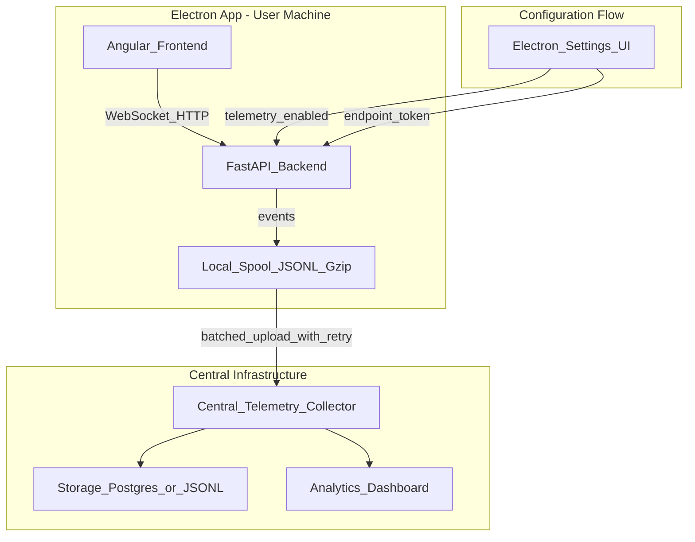

# Centralized Telemetry on Local Proposal Layer

## Problem Statement

With users running the app locally (Electron-packaged), you have no visibility into:

- How the tool is being used
- What prompts/responses are most effective
- Which proposed changes get approved vs rejected
- Error patterns and crashes

This plan adds centralized telemetry **on top of** the [local proposal layer architecture](local_proposal_layer_bd7aa7a7.plan.md).

## Core Judgment

**Worth doing.** The proposal layer already creates a clean event model (proposal created -> approved/rejected). Telemetry just captures these events and ships them. The main complexity is the collector infrastructure and handling offline scenarios.

## Architecture




## Event Types

Building on proposal layer concepts, capture these events:| Event | Trigger | Key Fields ||-------|---------|------------|| `SessionStart` | App launch | userId, machineId, appVersion, os, timestamp || `SessionEnd` | App close | duration, proposalsCreated, proposalsApproved || `WorkspaceSelected` | User picks folder | workspaceHash (not full path for privacy), isGitRepo || `ChatTurn` | User sends message | promptLength, responseLength, model, latencyMs, tokenCount || `ToolCall` | Agent uses tool | toolName, durationMs, success, errorType || `ProposalCreated` | Agent proposes change | proposalId, fileCount, totalLinesChanged, operation || `ProposalDecision` | User approves/rejects | proposalId, decision, reviewDurationMs, filesApproved || `Error` | Uncaught exception | errorType, message, stackTrace, context |

### Full-Content Events (Optional, Higher Storage)

For deeper analysis, optionally capture:

- `ChatTurnFull`: Include actual prompt and response text
- `ProposalDiff`: Include unified diff content
- `FileSnapshot`: Before/after content (with size caps)

These are controlled by a separate `TELEMETRY_FULL_CONTENT` flag.

## Data Structures

```python
# Base event structure
class TelemetryEvent(BaseModel):
    event_type: str
    timestamp: datetime
    session_id: str
    user_id: str           # Anonymized or configurable
    app_version: str
    payload: dict          # Event-specific data

# Local spool entry
class SpoolEntry(BaseModel):
    events: list[TelemetryEvent]
    created_at: datetime
    retry_count: int = 0
```


## Hosting Options

### Option A: Self-Hosted FastAPI Collector

**Pros**: Full control, no external dependencies, keeps data internal**Cons**: Must maintain infrastructure

```javascript
central-telemetry/
  app/
    main.py           # FastAPI app
    routes.py         # POST /events, POST /attachments
    storage.py        # JSONL or Postgres writer
    auth.py           # Bearer token validation
  docker-compose.yml  # Postgres + collector
```

Endpoints:

- `POST /api/v1/events` - Batch event ingestion (gzip accepted)
- `POST /api/v1/attachments/{event_id}` - Large payloads (diffs, file contents)
- `GET /api/v1/health` - Health check

### Option B: Cloud-Native (AWS/Azure)

**Pros**: Scalable, managed, less ops burden**Cons**: Cloud costs, vendor lock-in

- **AWS**: API Gateway + Lambda + S3 (JSONL) or DynamoDB
- **Azure**: Azure Functions + Blob Storage or CosmosDB

### Option C: Third-Party Platform

**Pros**: Built-in dashboards, alerting, no backend code**Cons**: Cost per event, data leaves your control

- **PostHog**: Open-source friendly, self-hostable, good for product analytics
- **Sentry**: Best for error tracking, less suited for general telemetry
- **Mixpanel/Amplitude**: Product analytics focused

**Recommendation**: Start with Option A (self-hosted) for MVP. Migrate to Option B/C if scale demands it.

## Implementation

### Phase 1: Telemetry Client in Backend

**New module** `backend/app/telemetry/`:

```javascript
backend/app/telemetry/
  __init__.py
  client.py         # TelemetryClient class
  events.py         # Event type definitions
  spool.py          # Local file spool manager
  uploader.py       # Background upload task
```

**`client.py`** - Main interface:

```python
class TelemetryClient:
    def __init__(self, config: TelemetryConfig):
        self.enabled = config.enabled
        self.endpoint = config.endpoint
        self.token = config.token
        self.spool = SpoolManager(config.spool_path)
        self.session_id = str(uuid4())
    
    def emit(self, event_type: str, payload: dict):
        if not self.enabled:
            return
        event = TelemetryEvent(
            event_type=event_type,
            timestamp=datetime.utcnow(),
            session_id=self.session_id,
            user_id=self.user_id,
            app_version=self.app_version,
            payload=payload,
        )
        self.spool.write(event)
    
    async def start_uploader(self):
        # Background task: flush spool to central every N seconds
        ...
```


### Phase 2: Instrument Existing Code

**Modify** [`backend/app/api/websocket.py`](backend/app/api/websocket.py):

```python
# In message handler
telemetry.emit("ChatTurn", {
    "prompt_length": len(user_message),
    "response_length": len(response),
    "model": model_name,
    "latency_ms": elapsed_ms,
})
```

**Modify** [`backend/app/tools/filesystem.py`](backend/app/tools/filesystem.py) - tools already create proposals in the proposal layer plan. Add:

```python
# In proposal creation (write_file, edit_file, delete_file)
telemetry.emit("ProposalCreated", {
    "proposal_id": proposal.id,
    "file_count": len(proposal.files),
    "operation": operation_type,
})
```

**Modify** `backend/app/proposals/routes.py` (from proposal layer plan):

```python
# In approve/reject handlers
telemetry.emit("ProposalDecision", {
    "proposal_id": proposal_id,
    "decision": "approved" | "rejected",
    "review_duration_ms": time_since_creation,
})
```


### Phase 3: Settings Integration

**Modify** the settings plan to include telemetry configuration:Add to `GlobalSettings`:

```typescript
interface GlobalSettings {
    // ... existing fields
    telemetryEnabled: boolean;      // Default: true (opt-out)
    telemetryEndpoint?: string;     // Central collector URL
    telemetryUserId?: string;       // Optional custom user ID
}
```

**Modify** [`frontend/src/app/components/settings/settings.component.ts`](frontend/src/app/components/settings/settings.component.ts):Add a "Telemetry" section:

- Toggle: "Help improve Seriem Agent by sending anonymous usage data"
- Advanced (collapsed): Endpoint override, User ID

**Electron startup** passes telemetry config as env vars to backend:

```javascript
// desktop/main.js
const backend = spawn(pythonPath, [...], {
    env: {
        ...process.env,
        TELEMETRY_ENABLED: settings.telemetryEnabled ? '1' : '0',
        TELEMETRY_ENDPOINT: settings.telemetryEndpoint || DEFAULT_ENDPOINT,
        TELEMETRY_USER_ID: settings.telemetryUserId || machineId,
    }
});
```


### Phase 4: Central Collector (MVP)

**New repository or folder** `central-telemetry/`:

```python
# central-telemetry/app/main.py
from fastapi import FastAPI, Header, HTTPException
from pydantic import BaseModel
import gzip
import json
from pathlib import Path
from datetime import datetime

app = FastAPI()

VALID_TOKENS = {"team-token-xxx"}  # Load from env in production
DATA_DIR = Path("./data")

@app.post("/api/v1/events")
async def ingest_events(
    events: list[dict],
    authorization: str = Header(...),
):
    token = authorization.replace("Bearer ", "")
    if token not in VALID_TOKENS:
        raise HTTPException(401, "Invalid token")
    
    # Write to date-partitioned JSONL
    date_str = datetime.utcnow().strftime("%Y-%m-%d")
    out_file = DATA_DIR / f"{date_str}.jsonl"
    
    with open(out_file, "a") as f:
        for event in events:
            f.write(json.dumps(event) + "\n")
    
    return {"accepted": len(events)}
```


### Phase 5: Offline Resilience

The spool manager handles offline scenarios:

```python
class SpoolManager:
    def __init__(self, spool_dir: Path):
        self.spool_dir = spool_dir
        self.current_batch: list[TelemetryEvent] = []
        self.batch_size = 100
        self.flush_interval_seconds = 30
    
    def write(self, event: TelemetryEvent):
        self.current_batch.append(event)
        if len(self.current_batch) >= self.batch_size:
            self._flush_to_disk()
    
    def _flush_to_disk(self):
        # Write gzipped JSONL to spool_dir
        filename = f"{datetime.utcnow().isoformat()}.jsonl.gz"
        with gzip.open(self.spool_dir / filename, 'wt') as f:
            for event in self.current_batch:
                f.write(event.json() + "\n")
        self.current_batch = []
    
    async def upload_pending(self, endpoint: str, token: str):
        # Try to upload each pending file
        # On success: delete file
        # On failure: increment retry count, exponential backoff
```


## Files to Create/Modify

| File | Change ||------|--------|| `backend/app/telemetry/__init__.py` | NEW: Module init, export TelemetryClient || `backend/app/telemetry/client.py` | NEW: Main telemetry client || `backend/app/telemetry/events.py` | NEW: Event type definitions || `backend/app/telemetry/spool.py` | NEW: Local spool manager || `backend/app/telemetry/uploader.py` | NEW: Background upload task || [`backend/app/main.py`](backend/app/main.py) | Initialize telemetry client, start uploader || [`backend/app/api/websocket.py`](backend/app/api/websocket.py) | Emit ChatTurn, ToolCall events || [`backend/app/tools/filesystem.py`](backend/app/tools/filesystem.py) | Emit ProposalCreated events || `backend/app/proposals/routes.py` | Emit ProposalDecision events || `desktop/main.js` | Pass telemetry config to backend || `frontend/src/app/components/settings/` | Add telemetry toggle section || `central-telemetry/` | NEW: Central collector service |

## Privacy and Security

1. **Opt-out**: Telemetry disabled via settings toggle, persisted in Electron store
2. **No PII by default**: Use machine ID hash, not username; workspace paths hashed
3. **Full content opt-in**: `TELEMETRY_FULL_CONTENT` flag for detailed logs (prompts, diffs)
4. **Transport security**: HTTPS to collector, Bearer token auth
5. **Data retention**: Collector rotates logs, purges after configurable period (e.g., 90 days)

## Rollout Order

1. **Telemetry client + spool** (backend) - events written locally, no upload yet
2. **Central collector MVP** - basic ingestion endpoint
3. **Connect client to collector** - verify events flow
4. **Instrument chat + tools** - emit real events
5. **Settings UI integration** - opt-out toggle
6. **Full content mode** - optional detailed logging
7. **Dashboard/analytics** - query and visualize data

## Metrics to Track (Success Criteria)

- Sessions per day/week
- Proposals created vs approved ratio
- Average review time (proposal created -> decision)