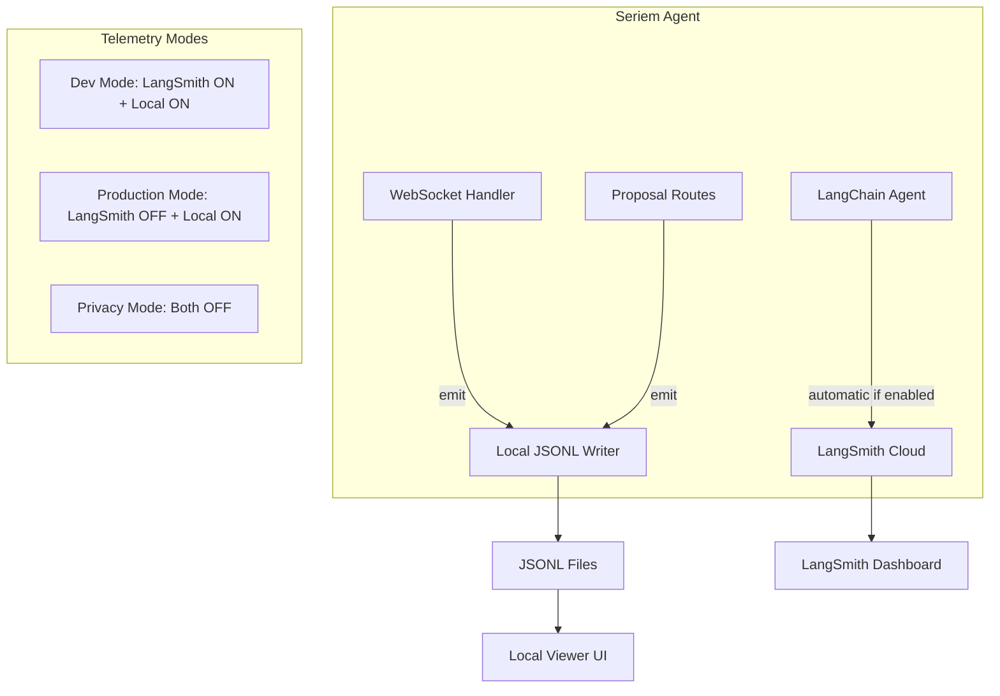

# Hybrid Telemetry Strategy

## Architecture Overview




## Key Changes to Existing Plan

### 1. Add LangSmith Integration (Minimal Effort)

**Modify** [`backend/app/main.py`](backend/app/main.py):

```python
# LangSmith configuration (optional - for development)
LANGSMITH_TRACING = os.getenv("LANGSMITH_TRACING", "false").lower() == "true"
if LANGSMITH_TRACING:
    print("[OK] LangSmith tracing enabled")
```

**Add to** [`backend/.env`](backend/.env) (user-configurable):

```bash
# Optional: Enable LangSmith for development tracing
LANGSMITH_TRACING=false
LANGSMITH_API_KEY=
```

**Update** `frontend/src/app/components/settings/settings.component.ts`:

- Add optional "LangSmith API Key" field (only shown if user wants cloud tracing)
- Add toggle for "Enable LangSmith Tracing (Development)"

### 2. Simplify Local Telemetry Scope

Since LangSmith automatically captures LLM/tool-level traces when enabled, the local JSONL system should focus on **business-level events** that LangSmith does not track:| Keep in JSONL Plan | Remove/Defer ||-------------------|--------------|| SessionStart | ~~ChatTurn latency~~ (LangSmith does this better) || ProposalCreated | ~~ToolCall duration~~ (LangSmith does this better) || ProposalDecision | ~~Token counts~~ (LangSmith tracks automatically) || Error (high-level) | || WorkspaceSelected | |**Simplified event types** in `backend/app/telemetry/events.py`:

```python
class SessionStartPayload(BaseModel):
    os: str
    app_version: str
    langsmith_enabled: bool  # Track whether deep tracing is available

class ProposalCreatedPayload(BaseModel):
    proposal_id: str
    file_count: int
    operations: list[str]

class ProposalDecisionPayload(BaseModel):
    proposal_id: str
    decision: Literal["approved", "rejected"]
    review_duration_ms: int

class ChatTurnPayload(BaseModel):
    # Simplified - just counts, not detailed metrics (LangSmith handles that)
    message_count: int
    had_tool_calls: bool
    had_error: bool
```


### 3. Update Settings UI

Add to [`frontend/src/app/components/settings/settings.component.ts`](frontend/src/app/components/settings/settings.component.ts):

```html
<section class="settings-section">
  <h3>Observability</h3>
  
  <!-- Local Telemetry -->
  <label class="toggle-row">
    <mat-slide-toggle [(ngModel)]="settings.localTelemetryEnabled">
      Collect usage data locally
    </mat-slide-toggle>
  </label>
  <p class="hint">Stored on your machine only. View with the telemetry viewer.</p>
  
  <!-- LangSmith (Optional) -->
  <div class="langsmith-section">
    <label class="toggle-row">
      <mat-slide-toggle [(ngModel)]="settings.langsmithEnabled">
        Enable LangSmith tracing (development)
      </mat-slide-toggle>
    </label>
    <p class="hint">Sends detailed traces to LangChain cloud for debugging.</p>
    
    @if (settings.langsmithEnabled) {
      <mat-form-field>
        <mat-label>LangSmith API Key</mat-label>
        <input matInput type="password" [(ngModel)]="settings.langsmithApiKey" />
      </mat-form-field>
      <a href="https://smith.langchain.com" target="_blank">Get API key</a>
    }
  </div>
</section>
```


### 4. Backend Environment Propagation

**Modify** [`desktop/main.js`](desktop/main.js) to pass LangSmith settings to backend:

```javascript
// When spawning backend, include LangSmith env vars if configured
const env = {
  ...process.env,
  ANTHROPIC_API_KEY: getStoredApiKey(),
  LANGSMITH_TRACING: store.get('langsmithEnabled') ? 'true' : 'false',
  LANGSMITH_API_KEY: store.get('langsmithApiKey') || '',
};
```


## Files to Modify

| File | Change ||------|--------|| [`backend/app/main.py`](backend/app/main.py) | Add LangSmith env var check and log || [`backend/.env.example`](backend/env.example) | Add LANGSMITH_TRACING and LANGSMITH_API_KEY || [`desktop/main.js`](desktop/main.js) | Pass LangSmith settings to backend env || [`desktop/preload.js`](desktop/preload.js) | Expose LangSmith settings IPC || [`frontend/src/electron.d.ts`](frontend/src/electron.d.ts) | Add LangSmith settings types || [`frontend/src/app/components/settings/settings.component.ts`](frontend/src/app/components/settings/settings.component.ts) | Add LangSmith toggle + API key field || [`frontend/src/app/services/settings.service.ts`](frontend/src/app/services/settings.service.ts) | Add LangSmith settings to GlobalSettings || [`.cursor/plans/local_telemetry_storage_0cd2cd4a.plan.md`](.cursor/plans/local_telemetry_storage_0cd2cd4a.plan.md) | Update scope to focus on business events |

## Benefits of Hybrid Approach