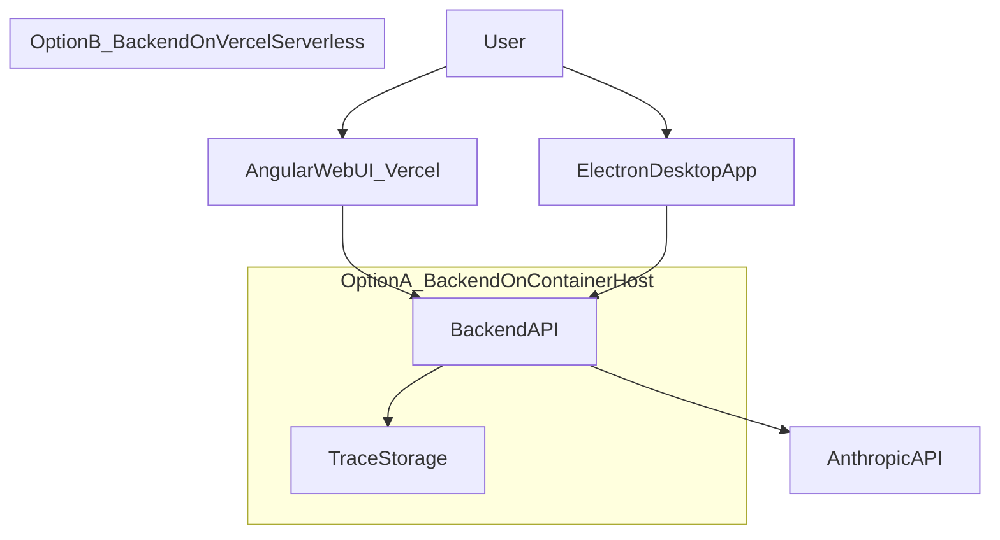

# Separate Frontend/Backend Dev (Monorepo) + Vercel Hosting + Electron Downloads

## What you already have (baseline)

- **Monorepo** with clear top-level boundaries: [`frontend/`](frontend/) (Angular), [`backend/`](backend/) (FastAPI), plus shared docs under [`docs/`](docs/).
- The architecture plan you referenced already makes the *right* separation move: **server owns model calls + auth + logging; client (Electron) owns local filesystem + git**. See: [`.cursor/plans/centralserver_electronclient_91ee771b.plan.md`](.cursor/plans/centralserver_electronclient_91ee771b.plan.md).

That separation is not “nice to have”: it’s what keeps you from building a security and complexity disaster (remote server reaching into local disks).

## Core separation (how frontend and backend dev stop stepping on each other)

### Data ownership and interfaces (the only thing teams share)

- **Frontend/Electron owns**:
  - UI state (chat history, open files)
  - Local workspace selection and *all* local FS + git operations (Electron main process via IPC)
- **Backend owns**:
  - Anthropic API key + LLM calls
  - Auth + rate limits
  - Durable traces/logs (but where “durable” lives depends on hosting choice)
- **Shared contract**:
  - A *small*, versioned HTTP API (and optionally a streaming channel) that returns:
    - chat responses
    - `ChangeProposal` objects (per-file before/after) for review

This is how you get a stable frontend: it only cares about the contract, not backend internals.

### Backward compatibility rule (so backend can iterate continuously)

- Treat the API contract as “userspace”: **never break it**.
- Add **API versioning** early (cheap now, painful later):
  - e.g. `/api/v1/...` for stable endpoints
  - `/api/experimental/...` for fast iteration without breaking the stable UI
- Deprecate instead of mutate:
  - additive fields are OK
  - renames/breaking changes require a new version

## Repo layout (single repo, but separated delivery)

Keep the **single monorepo** (your selection), but formalize “ownership” and independent pipelines.

### Suggested top-level structure

- [`frontend/`](frontend/) — Angular web app (also serves as Electron renderer)
- [`backend/`](backend/) — FastAPI
- `desktop/` — Electron main/preload + packaging (this matches the architecture plan)
- `contracts/` — API schema artifacts (OpenAPI JSON, generated TS types, etc.)
- [`docs/`](docs/) — product/agent docs (already present)

### Practical dev separation mechanisms

- **CODEOWNERS**: set ownership per directory (frontend team vs backend team).
- **Independent CI jobs**:
  - frontend checks only when `frontend/**` changes
  - backend checks only when `backend/**` changes
  - desktop checks only when `desktop/**` changes
  - contracts checks when `contracts/**` changes

## Hosting: Vercel for frontend, and 2 viable backend paths

### Target URLs (works with both backend paths)

- `app.yourdomain.com` → Vercel (Angular web UI)
- `api.yourdomain.com` → backend (either Vercel serverless or a container host)
- `download.yourdomain.com` (or `app.yourdomain.com/download`) → “get the Electron app” page + redirects

### Option A (recommended in practice): Frontend on Vercel, backend on a long-running host

This keeps the backend architecture from your plan intact (WebSocket streaming + server-side logging) without fighting Vercel’s serverless constraints.

- **Backend host**: Fly.io / Render / Railway / a VM / container platform
- **Why it fits your current backend**:
  - FastAPI can run as a normal ASGI server
  - WebSockets are straightforward (your repo already has [`backend/app/api/websocket.py`](backend/app/api/websocket.py))
  - “trace logs as JSONL files” can be stored on a persistent volume (or later moved to S3/db)

### Option B (possible, but you pay for it): Backend on Vercel (serverless)

You *can* run Python on Vercel, but the moment you rely on WebSockets + local file logging, you’re fighting the platform.

- **Key implications**:
  - **WebSockets**: generally a bad fit; you’ll likely need to switch to **SSE** or polling, or use a managed realtime service.
  - **Filesystem logging**: Vercel filesystem is **ephemeral**; JSONL-to-disk is not “durable”. You must log to **external storage** (S3/R2/Postgres/Supabase/etc.).
  - **Timeouts/concurrency**: long LLM calls and streaming need careful handling.

So Option B is “doable”, but it changes backend behavior enough that it should be an explicit decision.

### Hosting topology (both options)

## Electron download + updates (where it lives and how it works)

### Recommended distribution (lowest friction): GitHub Releases + Vercel “Download” page

- **Build artifacts** (installers) live in **GitHub Releases**.
- The Vercel frontend provides a **Download** page/route that:
  - detects OS (Windows/macOS/Linux)
  - fetches the latest GitHub release metadata
  - redirects to the right asset (or shows manual links)

### Auto-update story (so users don’t re-download manually)

- Use `electron-builder` + `electron-updater`.
- Configure updater provider:
  - **GitHub provider** (simple): Electron app checks GitHub for updates.
  - or **Generic provider** (enterprise): Electron app checks your `download.yourdomain.com` which serves update metadata + binaries from S3/R2.

### What Vercel does here

Vercel should **not** be your binary blob store. It should be the stable “front door” (UI + download redirect page), while binaries live on GitHub Releases or object storage.

## How to keep the frontend stable while backend changes continuously

- **Pin the frontend to `/api/v1`** and only consume stable message types.
- Put fast-moving backend experiments behind:
  - `/api/experimental` endpoints, or
  - a versioned `ChangeProposal.modelMeta.capabilities` field, so UI can feature-gate.
- Add a **contract test** that runs in CI:
  - backend emits OpenAPI
  - frontend build checks that required endpoints/types still exist

## Rollout plan (minimize risk)

- **Phase 1**: Deploy Angular web UI to Vercel; deploy backend using Option A or B (your choice later). Wire frontend config to point at `api.*`.
- **Phase 2**: Implement the architecture-plan split: backend returns `ChangeProposal`; Electron owns filesystem + apply step (new `desktop/`).
- **Phase 3**: Add the Vercel-hosted `/download` page + GitHub Releases pipeline for Electron installers.
- **Phase 4**: Harden compatibility: introduce `/api/v1`, deprecations, and contract tests.

## Files you’ll most likely touch while doing this

- Frontend: [`frontend/src/app/services/agent.service.ts`](frontend/src/app/services/agent.service.ts) (API base + streaming), plus a new download route/component.
- Backend: [`backend/app/api/routes.py`](backend/app/api/routes.py) (proposal endpoint), [`backend/app/api/websocket.py`](backend/app/api/websocket.py) (if streaming kept).
- Electron: new `desktop/` folder as in the architecture plan.
- Docs: any agent tool/scope changes must update [`docs/seriem-agent/agents/`](docs/seriem-agent/agents/).