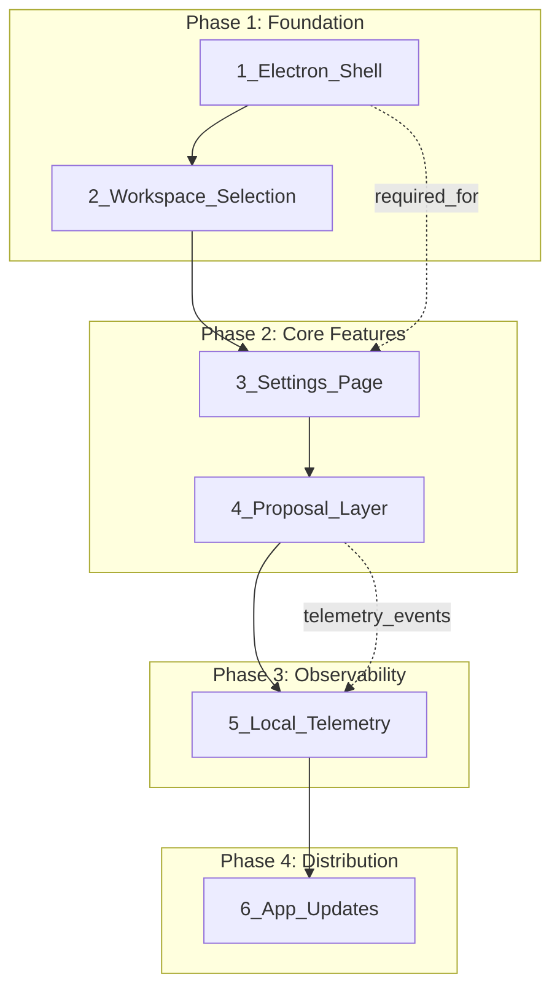

# Seriem Agent Implementation Roadmap

## Plan Classification

### OUT OF SCOPE (Do Not Implement)

| Plan | Reason ||------|--------|| `centralserver_electronclient_91ee771b.plan.md` | Centralized backend architecture - contradicts local-only approach || `centralized_telemetry_layer_3ec91d4d.plan.md` | Requires central server infrastructure || `localhost_with_central_telemetry_246652c5.plan.md` | Pre-Electron plan, superseded by local_proposal_layer || `frontend-backend-separation_ba6e6ce9.plan.md` | References centralized architecture and Vercel hosting |**Recommendation**: Archive these files to `.cursor/plans/archived/` to keep the plans folder clean.

### IN SCOPE (Implementation Order)

---

## Phase 1: Foundation (Electron Shell + Workspace)

**Plan**: [`local_proposal_layer_bd7aa7a7.plan.md`](local_proposal_layer_bd7aa7a7.plan.md) - Phases 0-1**Goal**: Get the basic Electron app running, spawning the Python backend, and allowing workspace selection.| Step | Description | Files ||------|-------------|-------|| 1.1 | Create `desktop/` folder with Electron main process | `desktop/main.js`, `desktop/package.json` || 1.2 | Create preload script with IPC bridge | `desktop/preload.js` || 1.3 | Python detection + venv setup on first run | `desktop/main.js` || 1.4 | Native folder picker IPC | `desktop/preload.js`, `desktop/main.js` || 1.5 | Backend workspace API | `backend/app/api/routes.py` || 1.6 | Frontend workspace selection UI | `frontend/src/app/services/file.service.ts` |**Deliverable**: User can launch .exe, select a folder, and see files in that folder.---

## Phase 2: Core Features (Settings + Proposals)

### 2A: Settings Page

**Plan**: `frontend_settings_page_ea4150ad.plan.md`**Dependency**: Requires Electron shell from Phase 1 (for secure storage IPC)| Step | Description | Files ||------|-------------|-------|| 2A.1 | Add `electron-store` for secure settings | `desktop/package.json`, `desktop/main.js` || 2A.2 | Settings IPC handlers | `desktop/main.js`, `desktop/preload.js` || 2A.3 | Backend workspace settings API | `backend/app/api/settings.py` || 2A.4 | Frontend settings service | `frontend/src/app/services/settings.service.ts` || 2A.5 | Settings UI component | `frontend/src/app/components/settings/` || 2A.6 | Header gear icon integration | `frontend/src/app/app.component.ts` |**Deliverable**: User can configure API key and Git credentials via Settings panel.

### 2B: Proposal Layer

**Plan**: [`local_proposal_layer_bd7aa7a7.plan.md`](local_proposal_layer_bd7aa7a7.plan.md) - Phases 2-4**Dependency**: Settings page (API key must be configurable first)| Step | Description | Files ||------|-------------|-------|| 2B.1 | Proposal models + in-memory store | `backend/app/proposals/` || 2B.2 | Proposal API endpoints | `backend/app/proposals/routes.py` || 2B.3 | Modify filesystem tools to create proposals | `backend/app/tools/filesystem.py` || 2B.4 | Update agent system prompt | `backend/app/agents/main_agent.py` || 2B.5 | Diff review UI component | `frontend/src/app/components/change-review/` || 2B.6 | Pending changes indicator | `frontend/src/app/app.component.ts` || 2B.7 | Optional: Git commit on approve | `backend/app/proposals/routes.py` |**Deliverable**: Agent proposes changes, user reviews diffs, approves/rejects before files are written.---

## Phase 3: Observability (Local Telemetry)

**Plan**: [`local_telemetry_storage_0cd2cd4a.plan.md`](local_telemetry_storage_0cd2cd4a.plan.md)**Dependency**: Proposal layer (to emit ProposalCreated/ProposalDecision events)| Step | Description | Files ||------|-------------|-------|| 3.1 | Telemetry module (client + JSONL writer) | `backend/app/telemetry/` || 3.2 | Telemetry API endpoints | `backend/app/api/telemetry.py` || 3.3 | Instrument WebSocket (ChatTurn events) | `backend/app/api/websocket.py` || 3.4 | Instrument tools (ToolCall events) | `backend/app/tools/filesystem.py` || 3.5 | Instrument proposals (ProposalCreated/Decision) | `backend/app/proposals/routes.py` || 3.6 | Telemetry viewer UI | `frontend/src/app/components/telemetry-viewer/` || 3.7 | Settings integration (telemetry toggle) | `frontend/src/app/components/settings/` |**Deliverable**: All events logged to local JSONL, viewable in app, exportable for later central upload.---

## Phase 4: Distribution (App Updates)

**Plan**: [`app_update_mechanism.plan.md`](app_update_mechanism.plan.md)**Dependency**: Stable Electron shell (Phase 1 complete)| Step | Description | Files ||------|-------------|-------|| 4.1 | Version endpoint in backend | `backend/app/api/routes.py` || 4.2 | Version check on Electron startup | `desktop/main.js` || 4.3 | Update notification UI | `frontend/src/app/components/update-banner/` || 4.4 | In-place app-code updater | `desktop/main.js` || 4.5 | Release script | `scripts/release.sh` |**Deliverable**: App notifies users of updates, downloads and applies app-code updates seamlessly.---

## Gaps (Now Integrated)

All previously identified gaps have been integrated into their respective plans:| Gap | Integrated Into ||-----|-----------------|| Electron TypeScript Types | [local_proposal_layer](local_proposal_layer_bd7aa7a7.plan.md) - Phase 0 || Browser Dev Mode Fallback | [frontend_settings_page](frontend_settings_page_ea4150ad.plan.md) - Runtime Environment Detection || Python Not Installed Handling | [local_proposal_layer](local_proposal_layer_bd7aa7a7.plan.md) - Phase 0 || Port Conflict Handling | [local_proposal_layer](local_proposal_layer_bd7aa7a7.plan.md) - Phase 0 || First-Run Experience | [local_proposal_layer](local_proposal_layer_bd7aa7a7.plan.md) - Phase 5 || Documentation Updates | [local_proposal_layer](local_proposal_layer_bd7aa7a7.plan.md) - Rollout Order step 13 |---